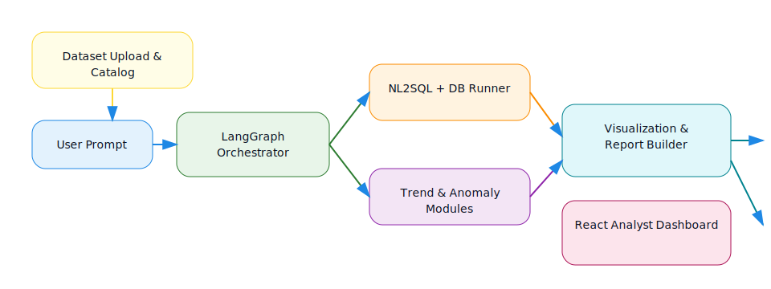

# InsightPilot – Autonomous Analytics Agent

InsightPilot is a production-style AI analyst that turns natural-language business questions into validated SQL, visualizations, insights, and executive-ready PDF reports. The stack combines LangGraph (deterministic agent workflow), FastAPI, SQLAlchemy, ReportLab, and a modern React dashboard.

## Project Highlights

- **Agentic LangGraph pipeline** – deterministic tool-calling chain (intent → schema → NL2SQL → execution → diagnostics → visualization → PDF) keeps results auditable.
- **Advanced analytics automation** – dedicated trend and anomaly modules mine every result set and stream context-aware summaries to the UI and PDF.
- **ReportLab title-page exports** – branded title page, SQL appendix, visuals, and analytics sections ready for exec briefings.
- **Draw.io workflow assets** – editable diagram (`docs/agent-workflow.drawio`) plus lightweight SVG for README embeds.
- **Reusable data ingestion** – dataset catalog + multi-table CSV upload lets you retarget the agent to any warehouse quickly.
- **Groq Llama‑3 tooling** – low-latency NL→SQL and narrative insight generation.

## Workflow Diagram (Draw.io)



> Edit the source diagram at `docs/agent-workflow.drawio` in Draw.io/Lucidchart and export a fresh SVG/PNG if the workflow changes.

## Advanced Analytics Modules

| Module | What it does | Output surfaces |
| --- | --- | --- |
| **Trend detection** | Converts the query result into a monthly time series, fits a regression, and quantifies direction, slope, and % change. | Chat insights, Latest Analysis cards, PDF “Trend Diagnostics”. |
| **Anomaly detection** | Computes z-scores across the same period and flags statistically significant outliers. | Latest Analysis cards, PDF “Anomaly Highlights”. |

The insight LLM receives both diagnostics, so follow-up prompts remain grounded in prior conclusions.

## Architecture

| Layer | Tech | Notes |
| --- | --- | --- |
| API & Orchestration | FastAPI + LangGraph | Defines graph nodes for schema, NL2SQL, execution, viz, insight, and report building. |
| LLM | Groq `llama3-70b-8192` | Deterministic, low-latency NL2SQL + insight generation. |
| Data | SQLite via SQLAlchemy | Auto-generated `sales` dataset for local testing. |
| Visualization & Reports | Matplotlib, ReportLab/Platypus | Charts saved to `backend/static`, referenced in UI/PDF. |
| Frontend | React + Vite | Modern dashboard with prompt chips, chat, result stack, PDF download. |

## Prerequisites

- Python 3.9+
- Node.js 16+
- Groq API Key (for NL2SQL + insight generation)

## Backend Setup

```bash
cd backend
python -m venv venv
source venv/bin/activate        # Windows: venv\Scripts\activate
pip install -r requirements.txt
cp .env.example .env            # add GROQ_API_KEY and optional DATABASE_URL
python create_db.py             # optional; startup also seeds the sales table
python -m app.main              # runs on http://localhost:8000
```

`DATABASE_URL` defaults to `sqlite:///./test.db`. Ensure the `.env` file includes your `GROQ_API_KEY` for Groq access.

## Frontend Setup

```bash
cd frontend
npm install
npm run dev                     # http://localhost:5173
```

## Usage Flow

1. Start backend and frontend dev servers.
1. Upload CSVs via the “Dataset Control” card (or call `POST /api/upload-csv` with `file` + `table_name`). The agent now validates table names, swaps in new tables on demand, and refreshes the dataset catalog for quick reuse.
1. Open the React app, pick a quick prompt (e.g., “What were total sales by category?”) or type your own.
1. InsightPilot:

    - Reads DB schema & crafts SQL via Groq Llama‑3.
    - Executes SQL with SQLAlchemy/Pandas.
    - Generates Matplotlib charts and Groq insight summaries.
    - Streams insights to the chat, shows SQL/data preview, and produces a PDF.

1. Download the PDF to share with stakeholders.

## Dataset Upload & Multi-table Ingestion

- **Upload endpoint:** `POST /api/upload-csv` accepts `file` + `table_name`. Table names are validated (`[A-Za-z_][A-Za-z0-9_]*`) to keep SQL safe, and uploads replace/create tables atomically.
- **Catalog endpoint:** `GET /api/datasets` returns discovered tables along with row counts and column names so the frontend can surface a live catalog.
- **Frontend controls:** the Dataset Control card now includes a target-table input, catalog refresh button, and a list of available tables—making it trivial to pivot the agent to another fact table without redeploying anything.

## Project Structure

```text
backend/
  app/
    agents/graph.py          # LangGraph workflow
    api/routes.py            # FastAPI routes
    core/config.py           # Settings + env
    db/database.py           # Engine + auto seed
    services/analytics.py    # Trend & anomaly detection modules
    services/pdf_generator.py# ReportLab report builder
    services/csv_loader.py   # CSV ingestion + dataset catalog helpers
  static/                    # Generated charts & PDFs
  create_db.py               # Manual seed script
  requirements.txt

frontend/
  src/App.jsx, App.css       # React dashboard
  package.json
```

## Future Ideas

- Intent-specific LangGraph branches (comparison vs. forecasting).
- Supabase/Postgres adapters with connection pooling.
- Auth + team workspaces for insights and PDF history.

Enjoy exploring data with InsightPilot! 🚀
